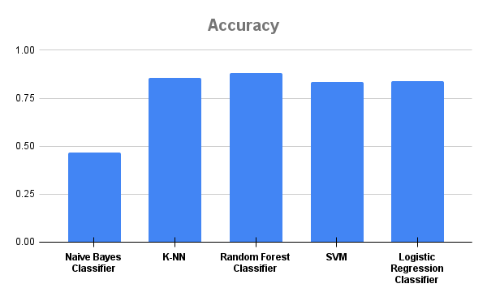
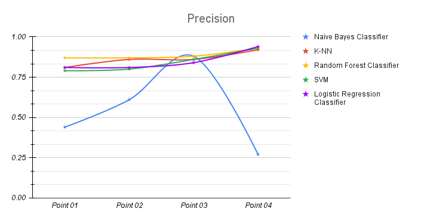
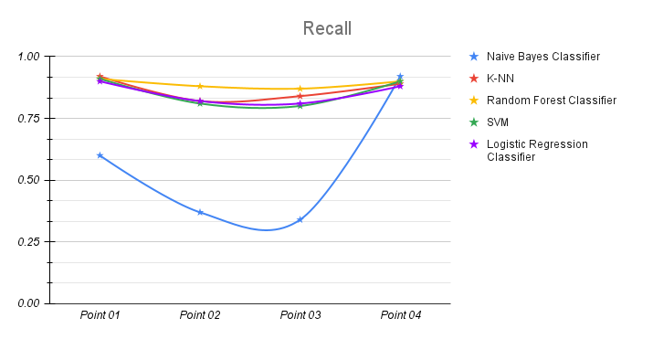
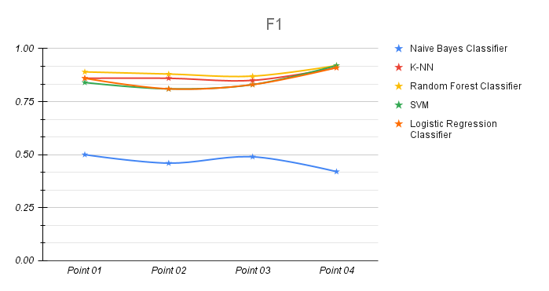

# Text Classification and Prediction with NLP and Machine Learning Algorithms 🏦📊

## Overview

This project involves classifying and predicting text data from bank customers using natural language processing (NLP) techniques and machine learning algorithms. The project demonstrates end-to-end text classification, starting from data preprocessing with NLTK and visualization with Matplotlib, to model training with various ML algorithms. The primary objective is to assess the performance of different classifiers in the context of banking operations.

## Project Steps

### 1. Dataset Loading, EDA, and Preprocessing 📂🔍
- **Tools**: Pandas, NLTK
- The dataset of 14000 bank customer records was explored and preprocessed. NLTK was used for tokenization, lemmatization, and stemming. Regular expressions were applied for cleaning, such as removing noise and irrelevant characters.
  
### 2. Data Visualization 📊🎨
- **Tools**: Matplotlib
- A variety of visualizations including line plots, scatter plots, bar charts, and heatmaps were created to uncover patterns and anomalies in the data.

### 3. Text Preprocessing with NLTK & Regular Expressions ✂️📑
- NLTK was leveraged to tokenize, stem, and lemmatize the data. This reduced the complexity of text data, improving its suitability for machine learning.
- Regular expressions (RE) were applied to clean up the dataset further by removing unnecessary characters and noise.

### 4. Corpus Formation and CountVectorizer 📜➡️📊
- **Tools**: CountVectorizer
- The text was transformed into a matrix of token counts, where CountVectorizer built a numerical representation of the text for machine learning algorithms to process.

### 5. Text Feature Normalization with TfidfTransformer 🔧📏
- **Tools**: TfidfTransformer
- TfidfTransformer was applied to scale the text data and balance the importance of frequently occurring terms, ensuring more nuanced patterns were captured.

### 6. Data Splitting 🧪📝
- The dataset was split into training (80%) and testing (20%) sets to evaluate the performance of the models.

### 7. Model Training 🤖
- **Algorithms Used**: Naive Bayes, K-Nearest Neighbor (KNN), Random Forest, Support Vector Machine (SVM), Logistic Regression
- Each algorithm was evaluated for accuracy, precision, recall, and F1 score to determine its suitability for classifying bank customers' text data.

## Results

The evaluation of machine learning algorithms yielded the following results:

| Algorithm          | Accuracy | Precision | Recall | F1 Score |
|--------------------|----------|-----------|--------|----------|
| Naive Bayes         | 0.4669   | Mixed     | Mixed  | Mixed    |
| K-Nearest Neighbor  | 0.8563   | High      | High   | High     |
| Random Forest       | 0.8826   | High      | High   | High     |
| Support Vector Machine (SVM) | 0.8365   | Balanced | Balanced | Balanced |
| Logistic Regression | 0.8387   | Balanced | Balanced | Balanced |

- **Naive Bayes**: Struggled with accuracy, recall, and F1 scores across different groups. More fine-tuning is needed to improve its performance.
- **K-NN**: Performed exceptionally well, maintaining high accuracy and consistency across all performance metrics.
- **Random Forest**: Achieved the highest accuracy and consistent performance, proving its robustness for complex data processing.
- **SVM**: Struck a good balance between precision and recall, making it suitable for handling non-linear data.
- **Logistic Regression**: Delivered balanced performance across all metrics, making it a strong candidate for banking operations automation.

  
  
  
  

## Tech Stack 🛠️
- **Programming Language**: Python
- **Libraries**: Pandas, NLTK, Matplotlib, Scikit-learn
- **Algorithms**: Naive Bayes, K-NN, Random Forest, SVM, Logistic Regression

## Future Work 🚀
- Explore hyperparameter tuning for Naive Bayes and SVM to enhance their performance.
- Implement real-time deployment for text classification models in a banking environment.
- Extend the dataset to cover a larger range of financial activities and improve model generalization.

## How to Use 📋
1. Clone the repo: `git clone https://github.com/username/project.git`
2. Run the script: `python main.py`

## Links
- [GitHub Repository](https://github.com/sabboshachi/Machine_Learning/tree/main/Projects/01.%20Text%20Classification%20with%20NLP%20and%20Machine%20Learning%20Algorithms%20%5BResearch%20Project%5D)
- [Dataset](https://github.com/sabboshachi/Machine_Learning/tree/main/Projects/01.%20Text%20Classification%20with%20NLP%20and%20Machine%20Learning%20Algorithms%20%5BResearch%20Project%5D/DataSet)
